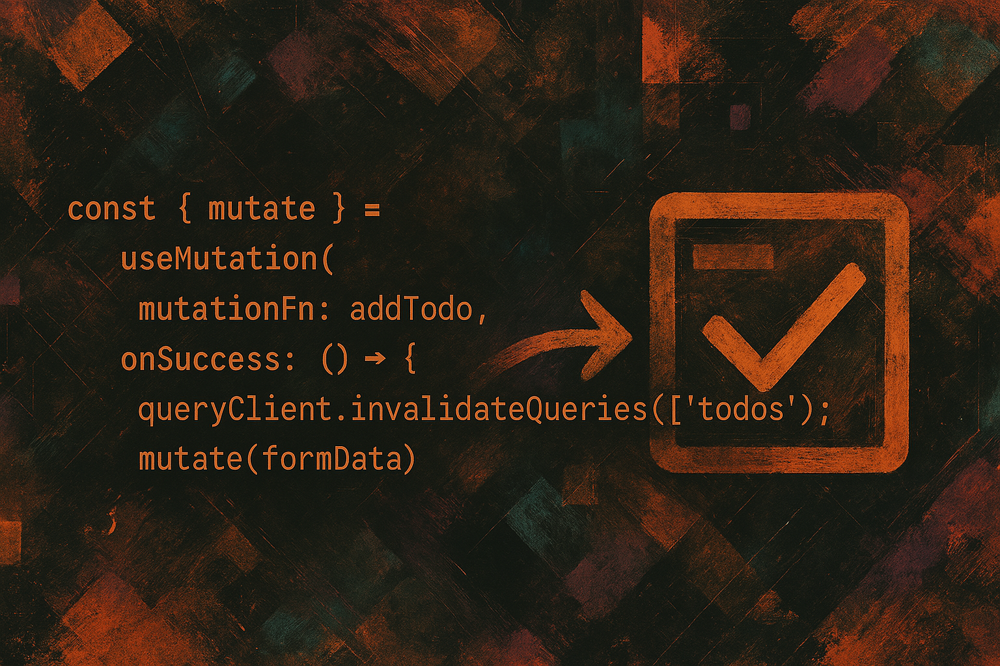

# Next.js Server Actions & Tanstack Query

## Das Dream-Team für dein Datenmanagement?

Dieses Repository enthält den Beispielcode für den dazugehörigen Blog-Artikel, der zeigt, wie man Tanstack React Query (v5) effektiv mit Next.js Server Actions im App Router kombiniert. Wir bauen eine einfache Todo-Anwendung Schritt für Schritt auf, um das Zusammenspiel dieser Technologien zu demonstrieren.

**➡️ https://www.sil3ntrunning.net/blog/next-js-server-actions-and-tanstack-query**
